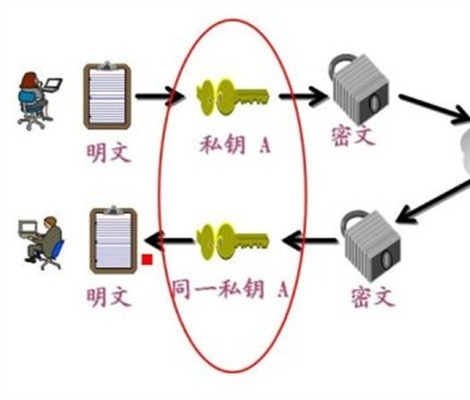

# crypto
crypto是node.js中实现加密和解密的模块 在node.js中，使用OpenSSL类库作为内部实现加密解密的手段 OpenSSL是一个经过严格测试的可靠的加密与解密算法的实现工具

## 散列(哈希)算法

吧任意长度的输入变成固定长度的输出. 常见的有 md5, sha1 等.

- 相同的输入会产生相同的输出
- 不同的输出会产生不同的输出
- 任意的输入长度输出长度是相同的
- 不能从输出推算出输入的值

## HMAC 算法

HMAC算法将散列算法与一个密钥结合在一起，以阻止对签名完整性的破坏.

## 对称加密

blowfish算法是一种对称的加密算法,对称的意思就是加密和解密使用的是同一个密钥。

## 非对称加密

- 非对称加密算法需要两个密钥：公开密钥(publickey)和私有密钥(privatekey)
- 公钥与私钥是一对，如果用公钥对数据进行加密，只有用对应的私钥才能解密,如果私钥加密，只能公钥解密
- 因为加密和解密使用的是两个不同的密钥，所以这种算法叫作非对称加密算法

