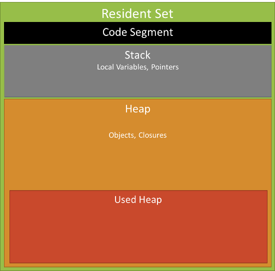

## 进程

### 进程对象属性
- execPath 可执行文件的绝对路径,如 /usr/local/bin/node
- version 版本号
- versions 依赖库的版本号
- platform 运行平台。 如 darwin、freebsd、linux、sunos、win32
- stdin 标准输入流可读流，默认暂停状态
- stdout 标准输出可写流，同步操作
- stderr 错误输出可写流，同步操作
- argv 属性值为数组
- env 操作系统环境信息
- pid 应用程序进程ID
- title 窗口标题
- arch 处理器架构 arm ia32 x64

### memoryUsage 方法


```
process.memoryUsage()
```

rss（resident set size）：所有内存占用，包括指令区和堆栈。
heapTotal："堆"占用的内存，包括用到的和没用到的。
heapUsed：用到的堆的部分。
external： V8 引擎内部的 C++ 对象占用的内存.

buffer 的内存是单独分配的, 属于 external.

node v8 引擎内容使用量是有上限的, 32位最多 1.4G, 64位最多 1.7G.


### nextTick 方法
nextTick方法用于将一个函数推迟到代码中所书写的下一个同步方法执行完毕或异步方法的回调函数开始执行前调用


### chdir
改变 Node.js 应用程序中使用的当前工作目录


### cwd 方法
返回当前目录, 不使用任何参数


### exit()
退出进程


### kill()
想进程发送一个信号

- SIGINT 程序终止信号, 在用户输入 INTR (Ctrip-C) 时发出, 通知前台进程组终止进程
- SIGTERM 程序结束信号, 该信号可以被阻塞和处理。通常用来要求程序自己正常退出，shell命令kill缺省产生这个信号

```
process.kill(pid,[signal]);
```
pid是一个整数，用于指定需要接收信号的进程ID
signal 发送的信号，默认为 SIGTERM


### uptime
返回当前程序的运行时间


### hrtime
测试一个代码段的运行时间,返回两个时间，第一个单位是秒，第二个单位是纳秒

```
let fs = require('fs);
let time = process.hrtime();
let data = fs.readFileSync('index.txt');
let diff = process.hrtime(time);
console.log(`读文件操作耗费的%d秒`,diff[0]);
```


### exit 事件
当运行Node.js应用程序进程退出时触发进程对象的exit事件。可以通过指定事件回调函数来指定进程退出时所执行的处理。

```
process.on('exit',function(){
    console.log('Node.js进程被推出);
});
process.exit();
```


### uncaughtException事件
当应用程序抛出一个未被捕获的异常时触发进程对象的uncaughtException事件


### SIGINT 信号事件


## 子进程
在Node.js中，只有一个线程执行所有操作，如果某个操作需要大量消耗CPU资源的情况下，后续操作都需要等待。

在Node.js中，提供了一个child_process模块,通过它可以开启多个子进程，在多个子进程之间可以共享内存空间，可以通过子进程的互相通信来实现信息的交换。

### spawn
```
child_process.spawn(command, [args], [options]);
```

- command 必须指定的参数，指定需要执行的命令
- args 数组，存放了所有运行该命令需要的参数
- options 参数为一个对象，用于指定开启子进程时使用的选项
    - cwd 子进程的工作目录
    - env 环境变量
    - detached 如果为true,该子进程魏一个进程组中的领头进程，当父进程不存在时也可以独立存在
    - stdio 三个元素的数组，设置标准输入/输出
        - pipe 在父进程和子进程之间创建一个管道，父进程可以通过子进程的stdio[0]访问子进程的标准输入，通过stdio[1]访问标准输出,stdio[2]访问错误输出
        - ipc 在父进程和子进程之间创建一个专用与传递消息的IPC通道。可以调用子进程的send方法向子进程发消息，子进程会触发message事件
        - ignore 指定不为子进程设置文件描述符。这样子进程的标准输入、标准输出和错误输出被忽略
        - stream 子进程和父进程共享一个终端设备、文件、端口或管道
        - 正整数值 和共享一个steam是一样的
        - null或undefined 在子进程中创建与父进程相连的管道

默认情况下，子进程的stdin,stdout,stderr导向了ChildProcess这个对象的child.stdin,child.stdout,child.stderr流,

```
let spawn = require('child_process').spawn;
sapwn('prg',[],{stdio:['pipe','pipe',process.stderr]});
```
- ignore ['ignore','ignore','ignore'] 全部忽略
- pipe ['pipe','pipe','pipe'] 通过管道连接
- inherit [process.stdin,process.stdout,process.stderr]或[0,1,2] 和父进程共享输入输出

```
let spawn = require('child_process').spawn;
spawn('prg',[],{stdio:'inherit'});
```
spawn方法返回一个隐式创建的代表子进程的ChildProcess对象

子进程对象同样拥有stdin属性值为一个可用于读入子进程的标准输入流对象

子进程对象同样拥有stdiout属性值和stderr属性值可分别用于写入子进程的标准输出流与标准错误输出流


#### close
当子进程所有输入输出都终止时，会触发子进程对象的 close 事件

```
child.on('close',function(code,signal){});
```

code 为0表示正常推出，为null表示异常退出
当在父进程中关闭子进程时，signal参数值为父进程发给子进程的信号名称

#### exit
当子进程退出时，触发子进程对象的exit事件
因为多个进程可能会共享i 个输入/输出，所以当子进程退出时，子进程的输入/输出可能并未终止

#### error

#### kil
父进程还可以使用kill方法向子进程发送信号,参数为描述该信号的字符串，默认参数值为SIGTERM
SIGTERM 程序结束(terminate)信号, 与SIGKILL不同的是该信号可以被阻塞和处理. 通常用来要求程序自己正常退出

```
child.kill([signal]);
```

#### detached
在默认情况下，只有在子进程全部退出后，父进程才能退出。

**为了让父进程可以先退出，而让子进程继续进行I/O操作,可以在spawn方法中使用options参数，把detached属性值设置为true**

默认情况下父进程会等待所有的子进程退出后才可以退出，使用subprocess.unref方法可以让父进程不用等待子进程退出就可以直接退出

```
let cp = require('child_process');
let fs = require('fs');
let path = require('path');
let out = fs.openSync(path.join(__dirname, 'msg.txt'), 'w', 0o666);
let sp = cp.spawn('node', ['4.detached.js'], {
  detached: true,
  stdio: ['ignore', out, 'ignore']
});
sp.unref(); // 父进程不用等待子进程退出就可以直接退出
```


### fork
**fork, exec, execFile 都是基于 spwan 的语法糖**

衍生一个新的 Node.js 进程，并通过建立一个 IPC 通讯通道来调用一个指定的模块，该通道允许父进程与子进程之间相互发送信息

fork方法返回一个隐式创建的代表子进程的ChildProcess对象

子进程的输入/输出操作执行完毕后，子进程不会自动退出，必须使用process.exit()方法显式退出

```
child_process.fork(modulePath,[args],[options]);
```
- args 运行该文件模块文件时命令使用的参数
- options 选项对象
    cwd 指定子进程当前的工作目录
    env 属性值为一个对象，用于以"键名/键值"的形式为子进程指定环境变量
    encoding 属性值为一个字符串，用于指定输出及标准错误输出数据的编码格式，默认值为'utf8'
    *silent* 属性值为布尔值，当属性值为false时，子进程和父进程对象共享标准(输入/输出),true时不共享

#### 发送消息
```
child.send(message,[sendHandle]);//在父进程中向子进程发送消息
process.send(message,[sendHandle]);//在子进程中向主进程发送消息
```
- message是一个对象，用于指定需要发送的消息
- sendHandle是一个 net.Socket 或 net.Server 对象
- 子进程可以监听父进程发送的message事件

```
process.on('message',function(m,setHandle){});
```
- m 参数值为子进程收到的消息
- sendHandle为服务器对象或socket端口对象


### exec 开启子进程
exec方法可以开启一个用于运行某个命令的子进程并缓存子进程的输出结果

**spawn是一个异步方法，exec是一个同步方法**

衍生一个 shell 并在 shell 上运行命令

```
child_process.exec(command,[options],[callback]);
```
- command 需要执行的命令
- options 选项对象
    cwd 子进程的当前工作目录
    env 指定子进程的环境变量
    encoding 指定输出的编码
    timeout 子进程的超时时间
    maxbuffer 指定缓存标准输出和错误输出的缓存区最大长度
    killSignal 指定关闭子进程的信号，默认值为 "SIGTERM"
- callback 指定子进程终止时调用的回调函数
    `function(err,stdout,stderr){}`


### execFile 开启子进程
可以使用execFile开启一个专门用于运行某个可执行文件的子进程

类似 child_process.exec()，但直接衍生命令，且无需先衍生一个 shell

```
child_process.execFile(file,[args],[optioins],[callback]);
```
- args 运行该文件所需要的参数
- callback 指定子进程终止时调用的回调函数


## cluster

