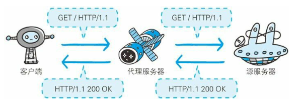

# Web 服务器

## 虚拟主机
一台HTTP服务器上搭建多个Web站点,客户端发送请求时必须在Host首部完整指定主机名或域名的URL.

客户端请求的 IP 地址和端口号是服务器端配置的固定值, 服务端根据请求的 Host 来判断请求的哪个服务.

## 通信转发程序: 代理, 网关
### 代理
代理就是客户端和服务器的中间人.

- 为啥使用代理?
  - 利用缓存技术减少网络流量
  - 组织内部针对网络进行访问控制
  - 获取访问日志

- 代理的分类
    - 缓存代理: 预先把资源副本保存在服务器上
    - 透明代理: 不对报文进行任何加工

### 网关
接收从客户端发送来的数据时，会转发给其他服务器处理，再由自己返回
