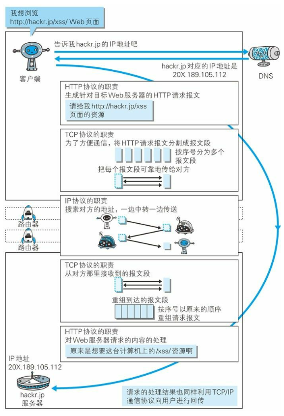
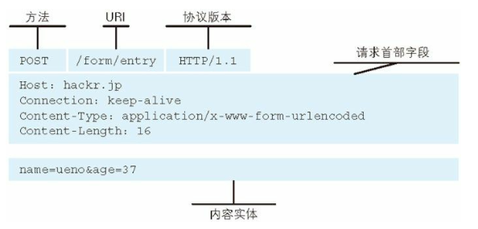
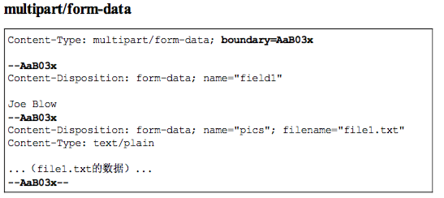
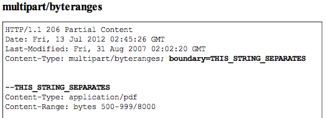
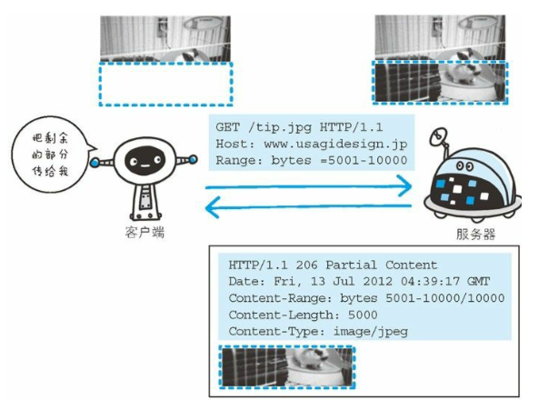
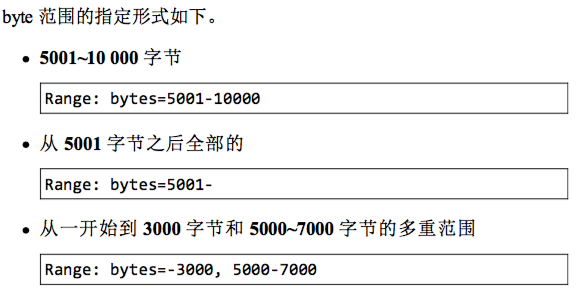

# HTTP 协议和 TCP 协议

## URI 和 URL
URI(Uniform Resource Identifier)是统一资源标识符,在某个规则下能把这个资源独一无二标示出来，比如人的身份证号

URL 统一资源定位符，表示资源的地点，URL时使用浏览器访问WEB页面时需要输入的网页地址

## HTTP 协议
HTTP是一种不保存状态的协议.

### 请求报文

- 请求行
方法 URL 协议/版本号

方法包括:
GET: 请求获取Request-URI所标识的资源
POST: 请求服务器接受所标识的资源
PUT: 请求服务器存储一个资源，并用Request-URI作为其标识
DELETE: 请求服务器删除Request-URI所标识的资源
HEAD: 请求获取由Request-URI所标识的资源的响应消息报头
OPTIONS: 请求查询服务器的性能，或者查询与资源相关的选项和需求

- 请求头
实体首部: 都是以 Content 开头的, 用来表述请求体的信息, 比如请求体的类型 Content-Type, 比如请求体的长度 Content-Length.

- 空行\r\n

- 请求体

### 响应报文
响应行, 响应头, 响应体

## 编码
### 多部份对象集合
一份报文主体中可以包含多类型实体。
使用boundary字符串来划分多部分对象指明的各类实体。在各个实体起始行之前插入--标记,多部分对象集合最后插入--标记

- 上传表单时使用multiparty/form-data

- multipart/byteranges: 状态码206(Partical Content)响应报文中包含多个范围时使用

### 获取部分内容的范围请求
为了实现中断恢复下载的需求，需要能下载指定下载的实体范围

请求头中的Range来指定 资源的byte范围

响应会返回状态码206响应报文

对于多重范围的范围请求，响应会在首部字段Content-Type中标明multipart/byteranges

用来断点续传/图片分片加载等

## 内容协商

首部字段(响应里):
- Accept
- Accept-Charset: 可以接受的字符编码集
- Accept-Encoding: 可以接受的压缩格式
- Accept-Language 
- Content-Language

协商类型
- 服务器驱动
- 客户端驱动协商
- 透明协商

## 状态码
类别	原因短语
1XX	Informational(信息性状态码)	：101 http 协议升级为 ws
2XX	Success(成功状态码)	
3XX	Redirection(重定向)	
4XX	Client Error(客户端错误状态码)	
5XX	Server Error(服务器错误状态吗)

### 2XX 成功
200(OK 客户端发过来的数据被正常处理)
204(Not Content 正常响应，没有实体)
206(Partial Content 范围请求，返回部分数据，响应报文中由Content-Range指定实体内容)

### 3XX 重定向
301(Moved Permanently) 永久重定向
302(Found) 临时重定向，规范要求方法名不变，但是都会改变
303(See Other) 和302类似，但必须用GET方法
304(Not Modified) 状态未改变 配合(If-Match、If-Modified-Since、If-None_Match、If-Range、If-Unmodified-Since)
307(Temporary Redirect) 临时重定向，不该改变请求方法

### 4XX 客户端错误
400(Bad Request) 请求报文语法错误
401 (unauthorized) 需要认证
403(Forbidden) 服务器拒绝访问对应的资源
404(Not Found) 服务器上无法找到资源

### 5XX 服务器错误
500(Internal Server Error)服务器故障
503(Service Unavailable) 服务器处于超负载或正在停机维护

## 首部
### 通用首部
首部字段名	说明
Cache-Control	控制缓存行为
Connection	链接的管理
Date	报文日期
Pragma	报文指令
Trailer	报文尾部的首部
Trasfer-Encoding	指定报文主体的传输编码方式
Upgrade	升级为其他协议
Via	代理服务器信息
Warning	错误通知

### 请求首部字段
首部字段名	说明
Accept	用户代理可处理的媒体类型
Accept-Charset	优先的字符集
Accept-Encoding	优先的编码
Accept-Langulage	优先的语言
Authorization	Web认证信息
Expect	期待服务器的特定行为
From	用户的电子邮箱地址
Host	请求资源所在的服务器
If-Match	比较实体标记
If-Modified-Since	比较资源的更新时间
If-None-Match	比较实体标记
If-Range	资源未更新时发送实体Byte的范围请求
If-Unmodified-Since	比较资源的更新时间(和If-Modified-Since相反)
Max-Forwards	最大传输跳数
Proxy-Authorization	代理服务器需要客户端认证
Range	实体字节范围请求
Referer	请求中的URI的原始获取方
TE	传输编码的优先级
User-Agent	HTTP客户端程序的信息

### 响应首部字段
首部字段名	说明
Accept-Ranges	是否接受字节范围
Age	资源的创建时间
ETag	资源的匹配信息
Location	客户端重定向至指定的URI
Proxy-Authenticate	代理服务器对客户端的认证信息
Retry-After	再次发送请求的时机
Server	服务器的信息
Vary	代理服务器缓存的管理信息
www-Authenticate	服务器对客户端的认证

### 实体首部字段
首部字段名	说明
Allow	资源可支持的HTTP方法
Content-Encoding	实体的编码方式
Content-Language	实体的自然语言
Content-Length	实体的内容大小(字节为单位)
Content-Location	替代对应资源的URI
Content-MD5	实体的报文摘要
Content-Range	实体的位置范围
Content-Type	实体主体的媒体类型
Expires	实体过期时间
Last-Modified	资源的最后修改时间

