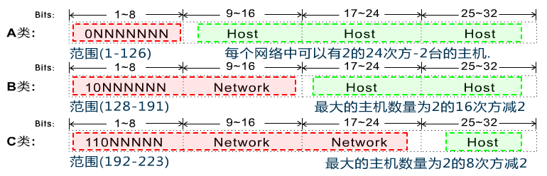
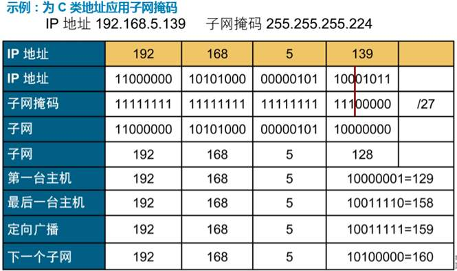

# IP
互联网协议, 用于在网络中定位计算机.

## IP 头部

总长度\分片(标识符)\TTL\源IP\目的IP\协议\校验和

## IP 地址格式
由32位二进制组成, 通常以点分十进制表示.

## IP 地址组成
- 网络部分
- 主机部分

## IP 地址分类
ip地址全为 1 时为广播地址, 全为 0 时为启动时的ip地址, 就是尚未分配时的ip地址.

除了 127.255.255.255外, 127 开头的地址代表本机.

### A类地址
网络号全为 0, 网络号 1-126.

### B类地址
网络号全为 10, 网络号 128-191.

### C类地址
网络号全为 110, 网络号 192-223.

## 公有地址和私有地址
分类	    范围
A类私有IP	10.0.0.0 ~ 10.255.255.255
B类私有IP	172.16.0.0 ~ 172.31.255.255
C类私有IP	192.168.0.0 ~ 192.168.255.255

其他范围的 IP 均为公有 IP. 公有 IP 不能出现在局域网内.

## 子网掩码
子网掩码(subnet mask)又叫子网络遮罩，它是一种用来**指明一个IP地址的哪些位标识的是主机所在的子网，以及哪些位标识的是主机位的掩码**。子网掩码不能单独存在，它必须结合IP地址一起使用。

子网掩码只有一个作用，就是将某个IP地址划分成网络地址和主机地址两部分。子网掩码也是32个二进制位

- 对应IP的网络部分用1表示, 对应IP地址的主机部分用0表示

- IP地址和子网掩码做逻辑**与运算**得到网络地址
    - 0和任何数相与都是0
    - 1和任何数相与都等于任何数本身

- A B C 三类地址都有自己默认的子网掩码
A类 255.0.0.0
B类 255.255.0.0
C类 255.255.255.0

#### 局域网划分
需要物理划分和子网划分
