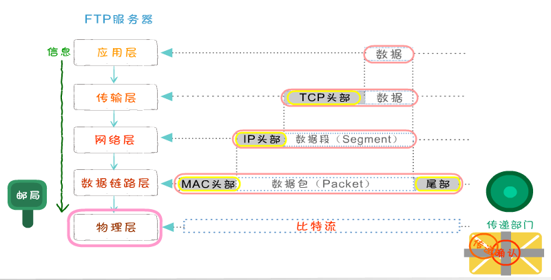

# 应用层

## 常见协议

## 发送方是从高层到低层封装数据

- 在应用层要把各式各样的数据如字母、数字、汉字、图片等转换成二进制
- 在TCP传输层中，上层的数据被分割成小的数据段，并为每个分段后的数据封装TCP报文头部
- **在TCP头部有一个关键的字段信息端口号，它用于标识上层的协议或应用程序，确保上层数据的正常通信**
- 计算机可以多进程并发运行，例如在发邮件的同时也可以通过浏览器浏览网页，这两种应用通过端口号进行区分
- 在网络层，上层数据被封装上报文头部(IP头部)，上层的数据是包括TCP头部的。IP地址包括的最关键字段信息就是IP地址，用于标识网络的逻辑地址。
- 数据链路径层，上层数据成一个MAC头部，内部有最关键的是MAC地址。MAC地址就是固化在硬件设备内部的全球唯一的物理地址。
- 在物理层，无论在之前哪一层封装的报文头和还是上层数据都是由二进制组成的，
物理将这些二进制数字比特流转换成电信号在网络中传输

## 可以使用 TCP 协议来封装实现 HTTP 协议
按照 HTTP 协议规范响应即可.

