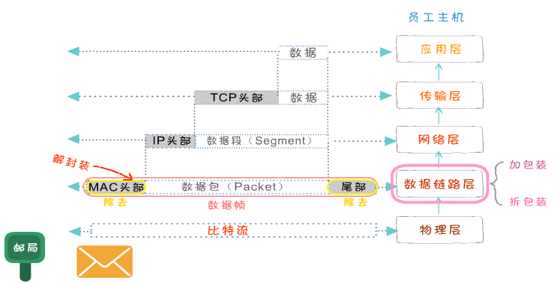
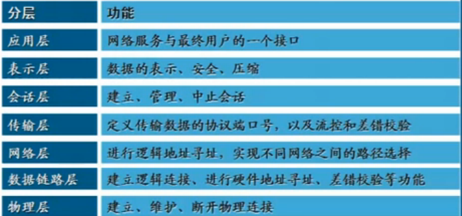
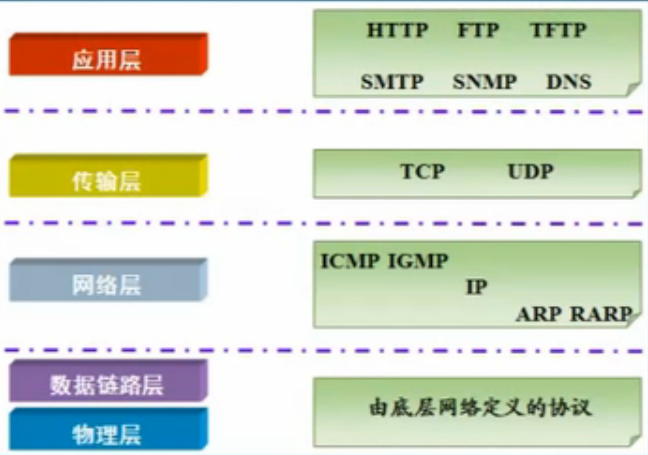
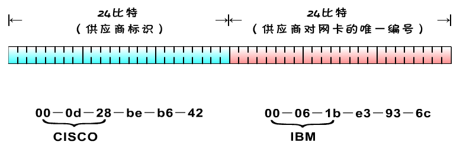
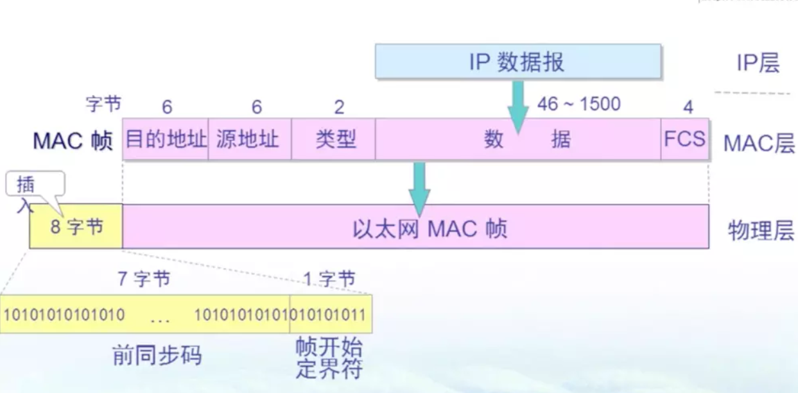

# TCP

## OSI 七层模型
物理层、数据链路层、网络层、传输层、会话层、表示层、应用层

### 各层功能

### 封装过程

## 协议
协议就是**数据封装格式+传输**

### 常用协议

## 网络接口层
TCP/IP 模型的最底层, 比较常见的是设备的驱动程序, 没有特定的协议.

### 物理层
**为用户提供一条物理传输媒体上传送和接收比特流的能力.**

- 非归零编码
- 曼彻斯特编码

### 数据链路层
将源自网络层的数据可靠地传输到相邻节点的目标机网络层. 该层数据被称为帧.

作用: 为两个网络实体之间提供数据链路通路的建立, 维持和释放. 处理传输差错, 调节发送速率(指数退让)

- 封装成帧
- 透明传输
- 差错检测
- 流量控制

交换机存在在数据链路层, 通过 MAC 地址连接主机通信.**路由器IP寻址网络层, 交换机 MAC 寻址数据链路层**

#### 以太网
计算机局域网技术. 总线技术:总线型拓扑和 载波监听多路访问/冲突检测(CSMA/CD)协议.

唯一48位 MAC 地址(局域网唯一).

#### 总线型拓扑
CSMA/CD

- 先听后讲
- 边听边讲
- 碰撞即停
- 退避重传: 二进制指数退避重传
- 多次碰撞, 放弃发送(16次)

#### MAC 地址

#### 以太网帧格式
- 在以太网链路上的数据包称作以太帧。以太帧起始部分由前导码和帧开始符组成
- 后面紧跟着一个以太网报头，以MAC地址说明目的地址和源地址
- 帧的中部是该帧负载的包含其他协议报头的数据包(例如IP协议)
- 以太帧由一个32位冗余校验码结尾。它用于检验数据传输是否出现损坏

