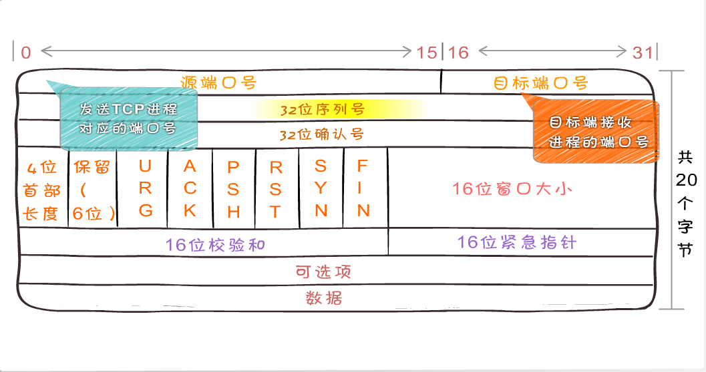
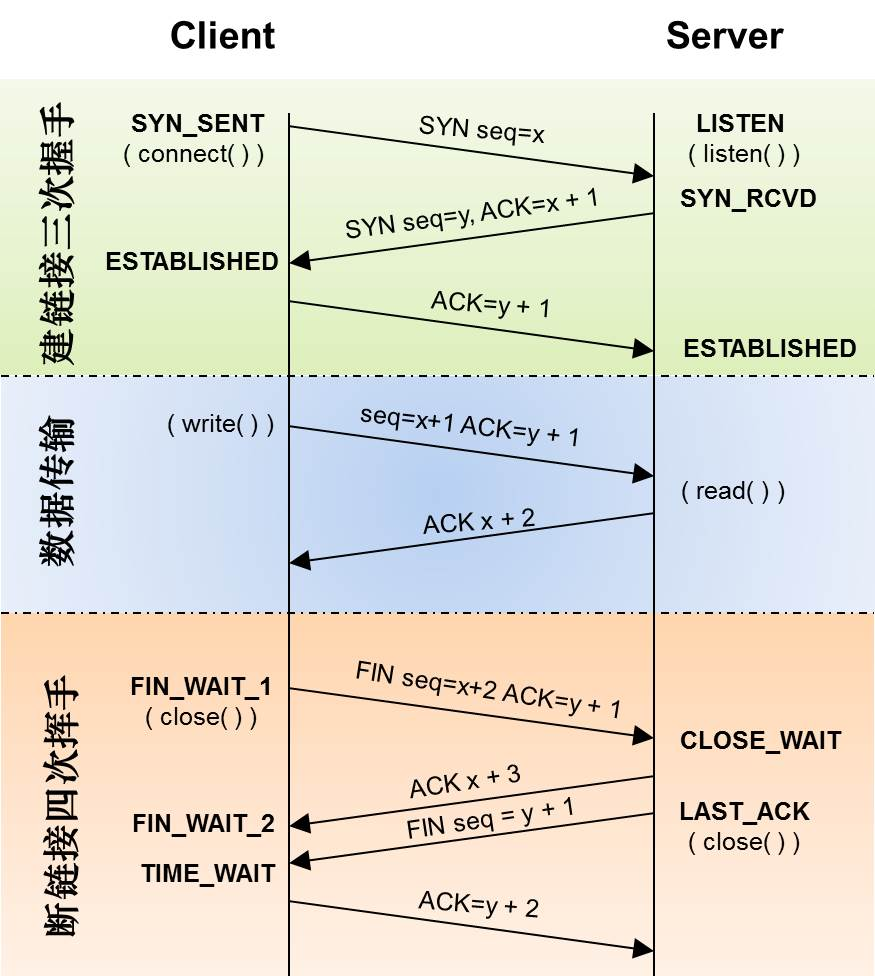
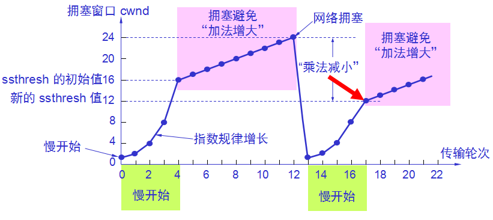
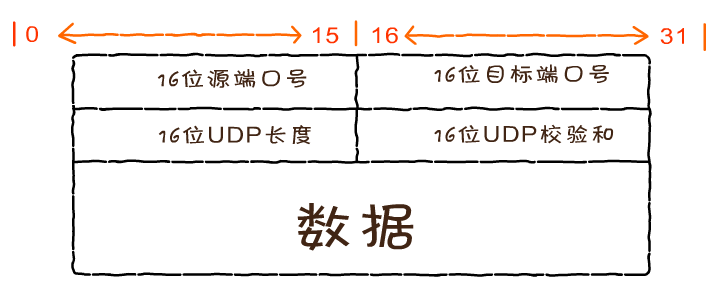
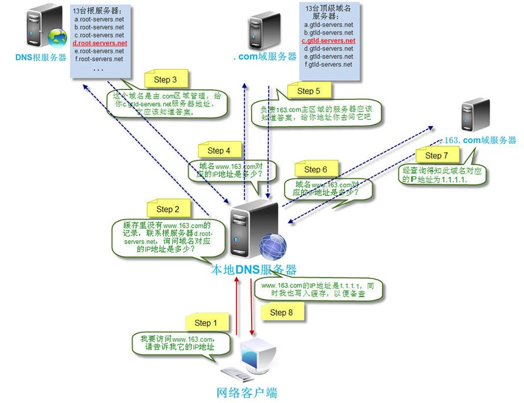
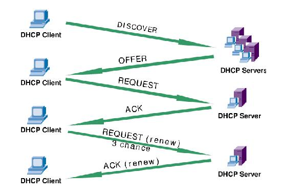

# 传输层
再不可靠的 IP 网络层基础上, 创建可靠的传输. 是面向连接的、可靠的的进程到进程通信的协议.

TCP提供全双工服务，即数据可在同一时间双向传播.

**提供一种端到端的链接**

TCP将若干个字节构成一个分组，此分组称为报文段(Segment).


## 协议分类
- TCP(Transimision Control Protocal)
    传输控制协议
    可靠的、面向连接的协议
    传输效率低

- UDP(User Datagram Protocal)
    用户数据报协议
    不可靠的、无连接的服务
    传输效率高


## TCP
- 分段传输
- 控制顺序
- 丢失重传
- 滑动窗口
- 拥塞控制

### TCP 数据包封装格式


- 源端口号和目标端口号，计算机通过端口号识别访问哪个服务,比如http服务或ftp服务，发送方端口号是进行随机端口，目标端口号决定了接收方哪个程序来接收

- 32位序列号: 用于顺序控制. TCP用序列号对数据包进行标记，以便在到达目的地后重新重装，假设当前的序列号为 s，发送数据长度为 l，则下次发送数据时的序列号为 s + l。在建立连接时通常由计算机生成一个随机数作为序列号的初始值

- 32位确认应答号: 它等于下一次应该接收到的数据的序列号。假设发送端的序列号为 s，发送数据的长度为 l，那么接收端返回的确认应答号也是 s + l。发送端接收到这个确认应答后，可以认为这个位置以前所有的数据都已被正常接收。

- 4位首部长度：TCP 首部的长度，每个字节表示 4。如果没有可选字段，这里的值是 5, 表示 TCP 首部的长度为 20 字节。

- 控制位: TCP的连接、传输和断开都受这**六个控制位**的指挥
    - PSH(push急迫位) 缓存区将满，立刻传输速度, 将数据传到应用层
    - RST(reset重置位) 连接断了重新连接
    - URG(urgent紧急位) 紧急信号.
    - SYN (建立联机): 同步序号位. TCP 建立连接时将这个值设为 1.
    - ACK (确认位): 确认对方已收到自己数据. 只有当 ACK 控制位为 1 时确认序号字段才有效。
    - FIN (结束位): 通知对方已结束传送，进入半关闭状态。请求断开连接.

- 16位窗口值: 说明本地可接收数据段的数目。当网络通畅时将这个窗口值变大加快传输速度，当网络不稳定时减少这个值可以保证网络数据的可靠传输。它是来在TCP传输中进行流量控制的. *窗口大小*：用于表示从应答号开始能够接受多少个 8 位字节。如果窗口大小为 0，可以发送**窗口探测**。窗口值是通过 ACK 响应给发送端, 所以当窗口值为0时, 发送端会发送窗口探测, 查看是否可以继续发送.

- 16位校验和: 用于检测数据在传输过程中是否出错。

- 16位紧急指针: 紧急指针：尽在 URG(urgent紧急) 控制位为 1 时有效。表示紧急数据的末尾在 TCP 数据部分中的位置。通常在暂时中断通信时使用（比如输入 Ctrl + C）


### TCP 握手与断开
TCP是面向连接的协议，它在源点和终点之间建立**虚拟连接**，而不是物理连接.

在数据通信之前，发送端与接收端要先建立连接，等数据发送结束后，双方再断开连接.

TCP连接的每一方都是由一个IP地址和一个端口组成.




### 滑动窗口
TCP中采用滑动窗口来进行传输控制，滑动窗口的大小意味着接收方还有多大的缓冲区可以用于接收数据。发送方可以通过滑动窗口的大小来确定应该发送多少字节的数据

**窗口大小 = 缓存区大小 - 缓存的字节数**

发送方和接收方都会维护一个滑动窗口，用来控制发送和接收的数据量.

当滑动窗口为0时，发送方一般不能再发送数据报，但有两种情况除外，一种情况是可以发送紧急数据，例如，允许用户终止在远端机上的运行进程。另一种情况是发送方可以发送一个1字节的数据报来通知接收方重新声明它希望接收的下一字节及发送方的滑动窗口大小

发送方窗口内的序列号代表了那些已经被发送，但是还没有被确认的帧，或者是那些可以被发送的帧


### 拥塞控制
TCP拥塞控制是传输控制协议（英语：Transmission Control Protocol，缩写TCP）避免网络拥塞的算法，是**互联网上**主要的一个**拥塞控制措施**. (对整个线路的流量控制)

TCP使用多种拥塞控制策略来避免雪崩式拥塞。TCP会为每条连接维护一个“拥塞窗口”来限制可能在端对端间传输的未确认分组总数量

这类似TCP流量控制机制中使用的滑动窗口，**是由发送方控制的**



- 慢启动
- 和式增加, 积式减少

TCP 的控制取 滑动窗口 和 拥塞窗口 两者较小的值.


## UDP
UDP是一个无连接、不保证可靠性的传输层协议，也就是说发送端不关心发送的数据是否到达目标主机、数据是否出错等，收到数据的主机也不会告诉 发送方是否收到了数据，它的**可靠性由上层协议来保障**

首部结构简单，在数据传输时能实现最小的开销，如果进程想发送很短的报文而对可靠性要求不高可以使用

### 数据包



## DNS 服务器
DNS是Domain Name Service的缩写，DNS服务器进行域名和与之对应的IP地址转换的服务器.

### 域名
根域 => 顶级域 => 二级域名 => 子域名

### 域名解析过程
分布式, 层次性



### DHCP 服务器
动态主机服务, 用来分配 IP 地址的服务器.

- 保证任何IP地址在同一时刻只能由一台DHCP客户机所使用。
- DHCP应当可以给用户分配永久固定的IP地址。
- DHCP应当可以同用其他方法获得IP地址的主机共存（如手工配置IP地址的主机）
- DHCP服务器应当向现有的BOOTP客户端提供服务。

**dhcp 属于应用层协议**


#### 工作流程


- 主机发送DHCPDISCOVER广播包在网络上寻找DHCP服务器；
- DHCP服务器向主机发送DHCPOFFER单播数据包，包含IP地址、MAC地址、域名信息以及地址租期；
- 主机发送DHCPREQUEST广播包，正式向服务器请求分配已提供的IP地址；
- DHCP服务器向主机发送DHCPACK单播包，确认主机的请求


## 组播
所谓的组播，就是将网络中同一业务类型进行逻辑上的分组，从某个socket端口上发送的数据只能被该组中的其他主机所接收，不被组外的任何主机接收。

实现组播时，并不直接把数据发送给目标地址，而是将数据发送到组播主机，操作系统将把该数据组播给组内的其他所有成员。

在网络中，使用D类地址作为组播地址。范围是指 224.0.0.0 ~ 239.255.255.255,分为三类
- 局部组播地址: 224.0.0.0 ~ 224.0.0.255 为路由协议和其他用途保留
- 预留组播地址: 224.0.1.0 ~ 238.255.255.255 可用于全球范围或网络协议
- 管理权限组播地址 ： 239.0.0.0 ～ 239.255.255.255 组织内部使用，不可用于Internet


把该socket端口对象添加到组播组中。

```socket.addMembership(multicastAddress,[multicastInterface]);```

multicastAddress 必须指定，需要加入的组播组地址
multicastInterface 可选参数，需要加入的组播组地址

```
socket.dropMembership(multicastAddress,[multicastInterface]);
socket.setMulticastTTL(ttl);
socket.setMulticastLoopback(flag);
```


