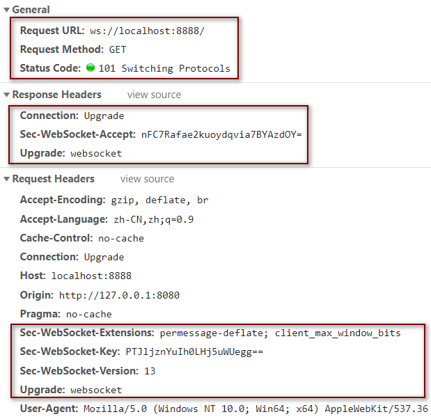
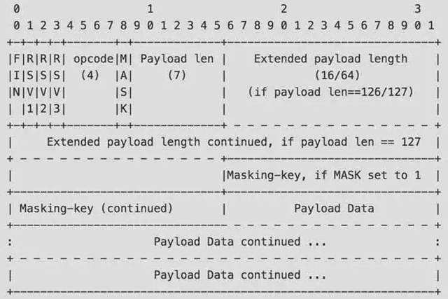
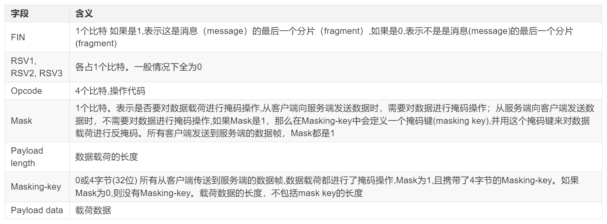
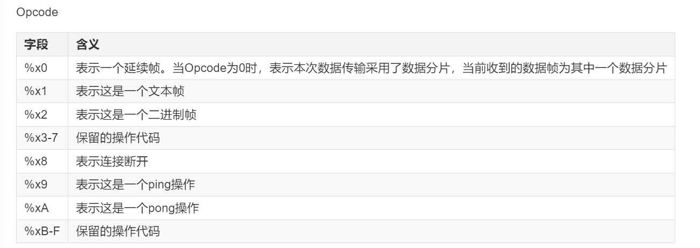
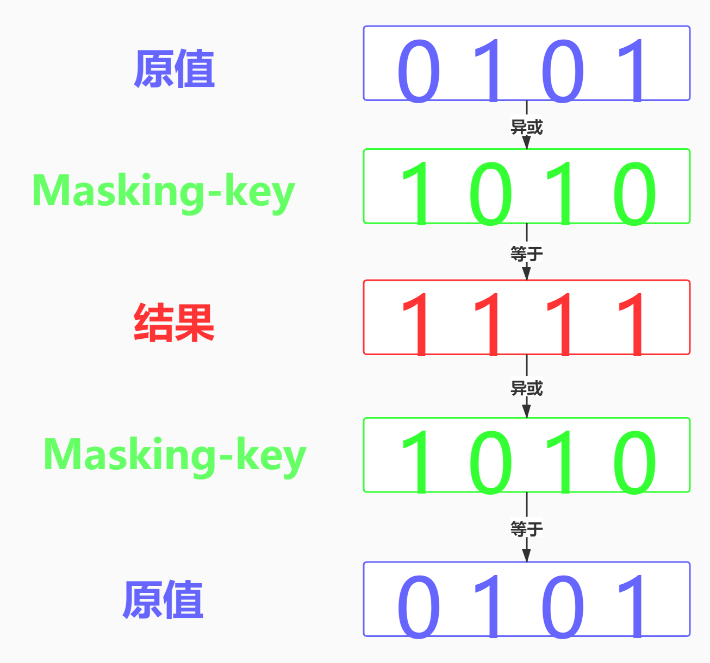

# webSocket
属于应用层协议, 基于 TCP 传输协议, 复用 HTTP 的握手通道

## ws连接
ws服用了 HTTP 的握手通道, 指的是客户端通过 HTTP 请求与 ws 服务端协商升级协议.

### 客户端: 申请协议升级
首先客户端发起协议申请请求, 采用标准的 http 报文格式, 只支持 get 方法.

请求头包括:
- Connection: Upgrade
- Upgrade: websocket
- Sec-WebSocket-Version: 13  表示要升级的ws版本
- Sec-WebSocket-Key: xxxxxxxx   该值是随机的, 用于握手阶段防止恶意构造的请求

### 服务端: 响应协议升级
状态码 101

响应头包括:
- Connection: Upgrade
- Upgrade: websocket
-Sec-WebSocket-Accept: xxxx 该值是根据客户端请求中的 Sec-WebSocket-Key 生成.

Sec-WebSocket-Accept 由 Sec-WebSocket-Key 与一字段进行拼接, 之后通过 SHA1 (哈希算法) 计算出摘要, 并且转成 base64 字符串.

## 数据帧格式

数据帧中包含了FIN, opcode, masking-key, payload-length等字段.

其中 payload length 表示了数据载荷的长度, 单位是字节.

Mask & Masking-key: 如果 Mask 标志位为 1, 则表示数据进行掩码处理.

## Payload length
7位

Payload length：数据载荷的长度，单位是字节。为7位，或7+16位，或7+64位
- Payload length=x为0~125：数据的长度为x字节。
- Payload length=x为126：后续2个字节代表一个16位的无符号整数，该无符号整数的值为数据的长度
- Payload length=x为127：后续8个字节代表一个64位的无符号整数（最高位为0），该无符号整数的值为数据的长度。
- 如果payload length占用了多个字节的话，payload length的二进制表达采用网络序(big endian，重要的位在前)

readBigUInt64BE 用指定的字节序[readBigInt64BE() 读取为大端序,readBigInt64LE() 读取为小端序]从 buf 中指定的 offset 读取一个有符号的 64 位整数值

Big-endian(大端序) 高位字节在前;
Little-endian(小端序) 低位字节在前;

## 掩码算法
掩码键 Masking-key 由客户端挑选出来的 4 位bit随机数. 所有从客户端传送到服务端的数据帧, 都会被加上掩码.

掩码不会影响数据长度. 目的是为了校验传输正确性.

