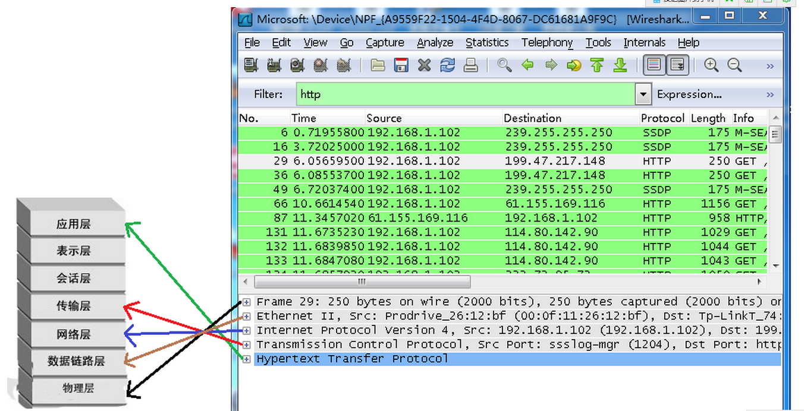
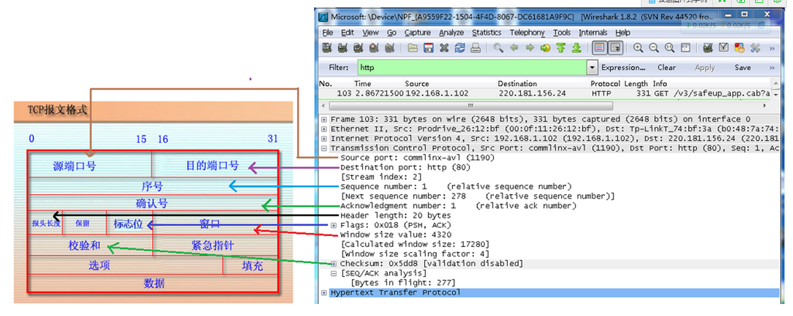

## 抓包过滤器

### 语法
协议+方向+类型+值

- HOST net port host
- 方向 src、dst、src and dst、src or dst
- 协议 ether ip tcp udp http ftp
- 逻辑运算符 && || !

eg.
- src host 192.168.1.1 && dst port 80 抓取来源地址为192.168.1.1，并且目的为80端口的流量
- host 192.168.1.1|| host host 192.168.1.2 抓取192.168.1.1或192.168.1.2的流量
- !broadcast 不抓取广播包
- tcp || arp || not tcp 过滤协议
- tcp.port == 80 过滤端口
- tcp.srcport == 80
- ip.src == 192.168.0.1
- ip.addr == 192.168.0.1

## Wireshark 对应 OSI 模型

### TCP 包

